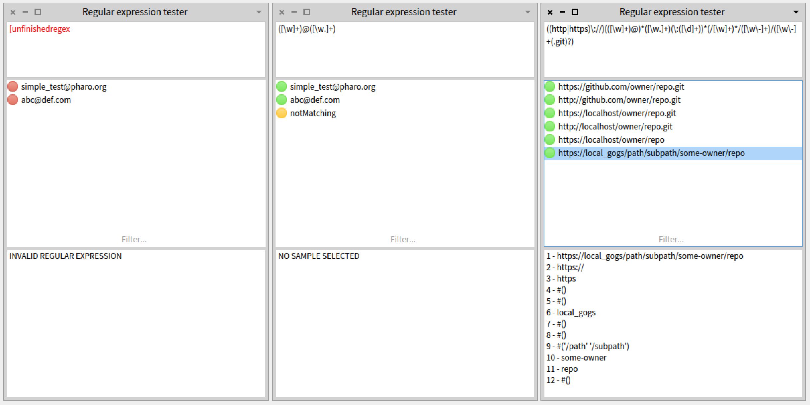
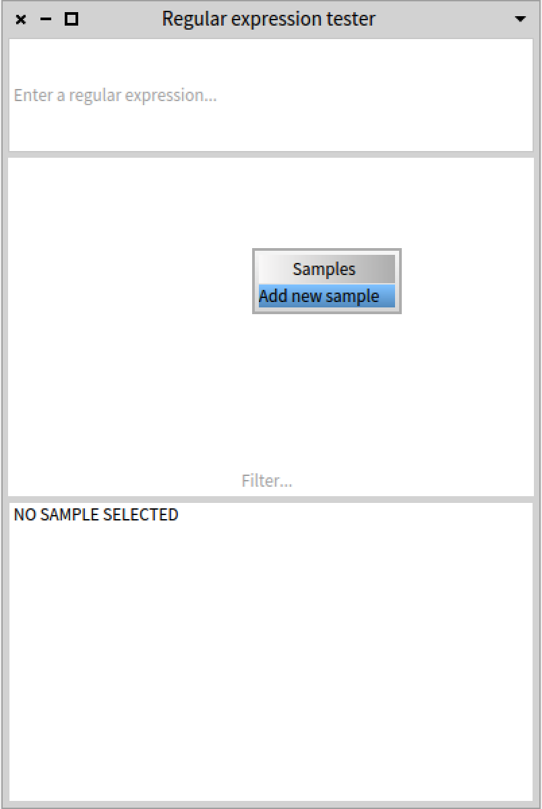
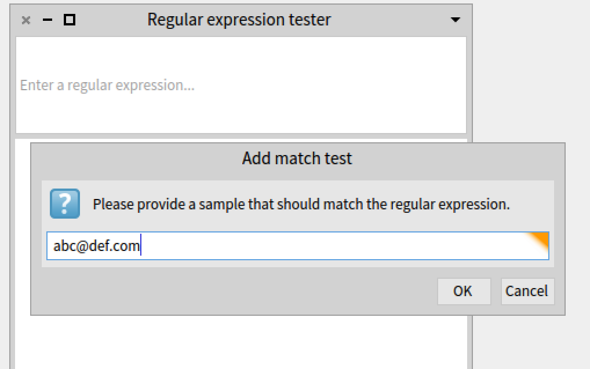
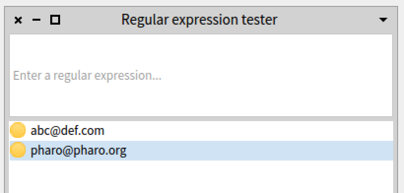
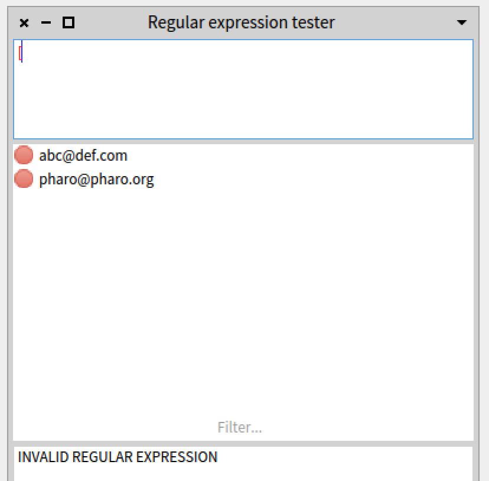
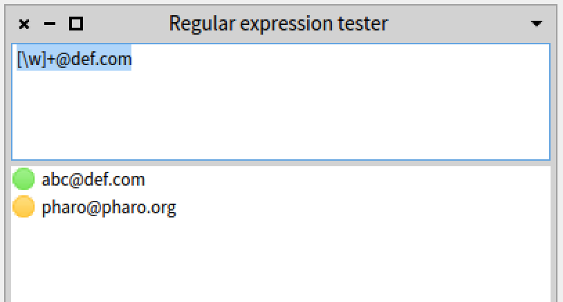
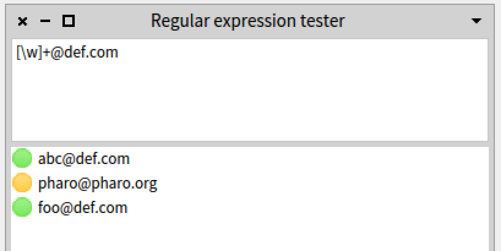
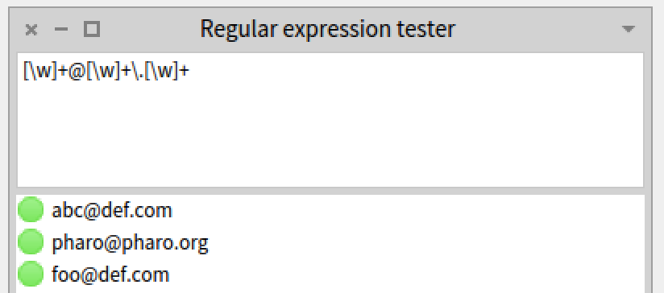
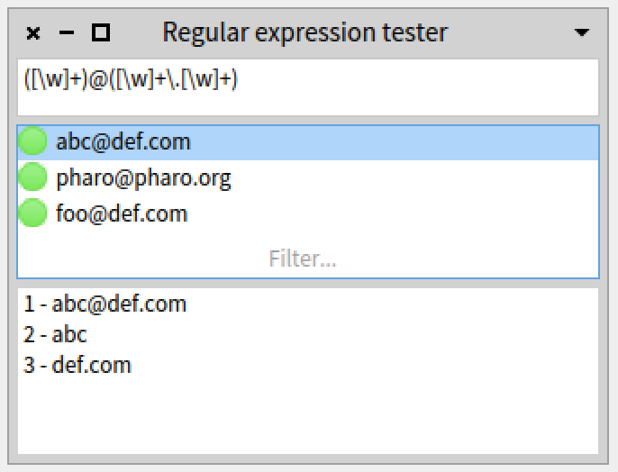

# Pharo-Regex-Tools
Simple tool to verify matches while developing with regular expressions in Pharo



## Installation

You can load the tool using the following load expression:

```Smalltalk
Metacello new
  baseline: 'RegexTools';
  repository: 'github://astares/Pharo-Regex-Tools/repository';
  load.
```

## Short guide

Open the **Regulare Expression Tester** from the Pharo **Tools** menu after you loaded the tool into your Pharo image. Alternatively you can evaluate

```Smalltalk
RegexTester open 
```
	
to open the window.	

Click in the middle pane with the samples and add a new test sample. 



A test sample is an example String that you would later like to be matched by the regular expression that you develop. It is something you would constantly get tested when writing your regular expression later in the upper pane.



So for instance if you would like to develop a regular expression for email matching you might want to add the following two example emails:



So far you have not written any regular expression - so both example emails could not match. Thats why they are displayed with a yellow icon.

Now start to enter your regular expression: just type in an **[** character into the edit field in the upper pane (which is a playground for the regular expression formula). 

While typing you will notice that the samples and the expression are displayed in red as **[** is an invalid regular expression and could not yet be parsed:



You can now develop your regular expression. The first naive approach to find a regular expression that is able to handle our emails could be that we separate the expression at the **@** character. Before the **@** character there can be any word. For the time being we say that we accept the samples when after the @ sign of the email there is a "def.com" domain.

The way to express this with a regular expression is like this:

	[\w]+@def.com
	
As we can see now only the first sample is accepted: 



As you see now the first test case turns green as with the given regular expression it would be possible to parse the sample. Let's verify that our first part works by giving another sample email address (foo@def.com) with the same domain to the system:



All samples that work will be displayed in **green** - all samples that wont work will be displayed in **yellow**. If your expression is invalid anything will be displayed in **red** again.

This should give enough room to experimenting further.

Accepting only email from "def.com" domain only would not be very useful. So we would like to adopt also the last part of our expression. The domain part "def.com" or "pharo.org" can be seen as
 
- a word
- followed by a dot 
- followed by another word (representing the top level domain)

Lets extend our regular expression accordingly

	[\w]+@[\w]+\.[\w]+
	
Now all the samples from this little tutorial are accepted. 



You can use the regular expression now in a Pharo method:

```Smalltalk
isValidEmail: aString
	"Returns true if the given String represents a valid email"

	|rx|
	rx := '[\w]+@[\w]+\.[\w]+' asRegex.
	^rx matches: aString
```

>Side note: Now our regular expression fits the purpose of the demonstration of the tool. If you like you can extend the expression even more. 

	
## Extended usage with subexpressions

Sometimes you are not only interested if a given string can be matched - but you would also be interested in the subparts that matched.

So in our simplified example we might be interested in the username of the domain name or the domain extension that was used.

For this we can divide our regular expression 

	[\w]+@[\w]+\.[\w]+

into smaller subexpression by using brackets. For instance we can have a pair of brackets before the @ sign to represent the **username part** of the mail and a pair of brackets after the @ sign to represent the whole **domain part**.

	([\w]+)@([\w]+\.[\w]+)

There is nothing changed except when you click on one of the first sample "abc@def.com" you will notice in the lower pane of the tool the results the subexpressions are shown additionally:



At the first index 1 we find the full match. At the second index 2 we find the username part (the first group) and in the third index we find the domain part which can be accessed with 3.

With this knowledge we can easily write a method on our MailChecker utility class that returns the domain part of an email address by letting the regular expression to the work for us:

```Smalltalk
domainPartFromEmail: aString
	"Returns the domain part of an email"

	|rx|
	rx := '([\w]+)@([\w]+\.[\w]+)' asRegex.

	(rx matches: aString)
		ifFalse: [ self error: 'not a valid email given' ].

	^rx subexpression: 3
```

If you would run

```Smalltalk
MailChecker domainPartFromEmail: 'abc@def.com'
```
	
afterwards it would correctly return "def.com" as result.

If you like you can further subdivide your regular expression, for instance like this:

	([\w]+)@(([\w]+)\.([\w]+))

to separate the **domain name** from the **domain extension** in the **domain part**
	
## Scripting

If you would like to script the tool you can easily do:

```Smalltalk
| tool |
tool := RegexTester new.
tool expression: '([\w]+)@(([\w]+)\.([\w]+))'.
tool matches: #('abc@def.org' 'pharo@pharo.org' 'foo@def.com' 'user@domain.org').
tool openWithSpec
``` 

This is especially useful if you would later reopen the tool on the samples you used. 
